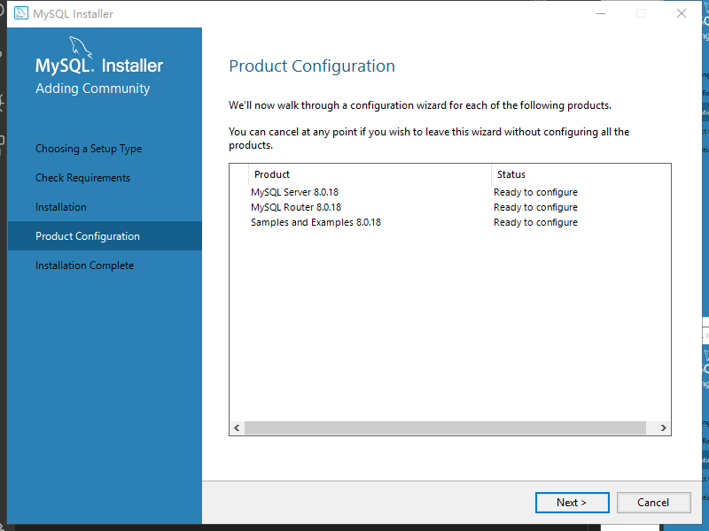
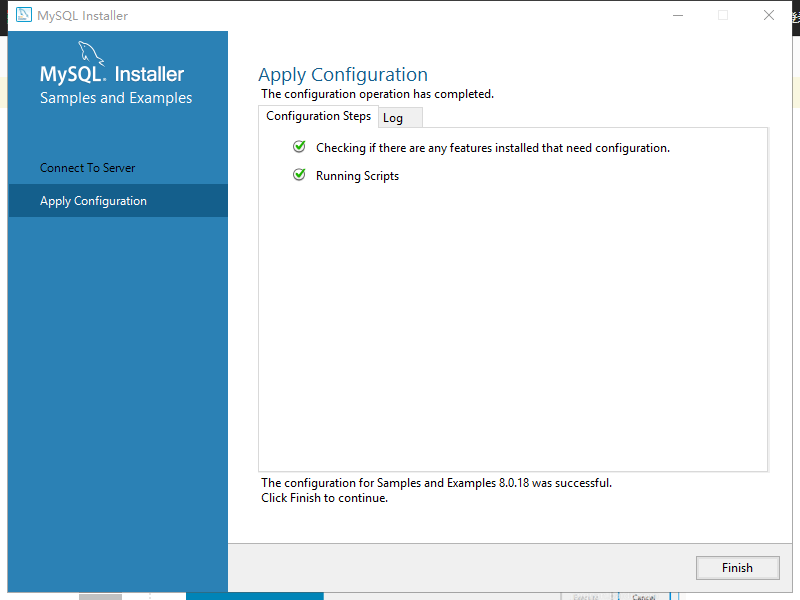
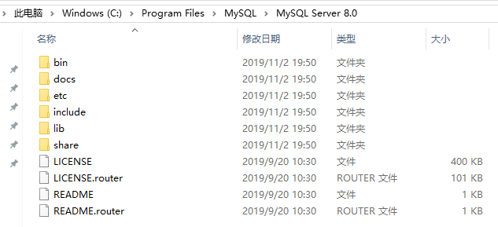

## 去官网  http://www.mysql.com/  点击DOWNLOAD  
  

## 点击链接  
  

## 点击 MySQL Community Server  
  

## 选择推荐下载的方式
  

## 选择第二个（红色框内的）点击download进入下载页面选择No thanks, just start my download就可以开始下载了，当然你要是想注册也可以注册一下。 
  

  

## 打开刚刚下载好的安装包，开始安装MySQL

## 这一步是检查安装条件，直接点击next进入下一步就可以了
在这一步可能会遇见的问题，[解决方案CSDN](https://blog.csdn.net/m0_37860933/article/details/81981663)
  

## 这里直接点击execute执行就可以了，执行完后点击next进入下一步。

 
  

## 继续点击next进入下一步
  

## 选择第一个然后点击next进入下一步

  

## 这里直接点击next进入下一步就可以了
  

## 点击next

  

## 设置root密码然后点击next进入下一步

  

## 点击next

  

## 点击Execute

  

## 点击next

  

## 点击finish

  

## 一路点击next，并check你的root密码，MySQL就成功在你的电脑上安装完成了

  

## 点击Execute 

  

## 全部显示绿色表示执行成功，点击finish

  

## 点击next

  

## 点击finish

  

## 安装完成后进入MySQL的安装目录，进入MySQL Sever，其目录下的文件如下

  

bin目录下保存了MySQL常用的命令工具以及管理工具、data目录是MySQL默认用来保存数据文件以及日志文件的地方（我的因刚安装还没有data文件夹）、docs目录下是MySQL的帮助文档、include目录和lib目录是MySQL所依赖的头文件以及库文件、share目录下保存目录文件以及日志文件。  

进入bin目录，按住shift键然后点击鼠标右键可以选择在该目录下打开命令窗口，或者在地址栏中输入cmd进入命令窗口。输入mysql -u root -p后回车，然后会提示输入密码，输入密码后就会进入MySQL的操作管理界面。 
输入show databases；（注意末尾有分号）可以查看当前MySQL中的数据库列表，输入use test；可以进入test数据库（前提是要有此数据库），输入show tables可以查看test数据库中的所有表，输入quit可以退出MySQL的操作管理界面。  

  

### 因为我安装的是目前的最新版，所以可能会和网上的博客有一些细小的区别  
推荐博客：
- https://blog.csdn.net/bobo553443/article/details/81383194
- https://jingyan.baidu.com/article/0bc808fc1fb9761bd585b97d.html