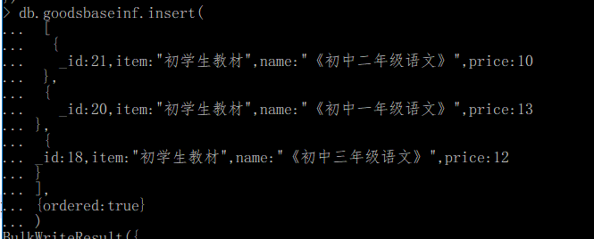

# MongoDB数据库建立相关命令
- 创建自定义数据库 use

```
use 数据库的名字
```
- 查看数据库

    - 如果该数据库不存在，则建立新的数据库；如果数据库存在，则连接该数据库，然后可以在数据库上做各种命令操作。
```
show dbs
```
- 统计某数据库的信息

    - 是你进入的那个数据库的信息

```
db.stats()
```
- 删除数据库

    -在生产环境下，不要随便使用该命令。因为执行该命令后对应的数据库文件就消失了，一般情况下具有不可恢复性。先进入那个要删除的数据库。

```
db.dropDatabase()
```

- 查看当前数据库下的集合名称 getCollectionNames()

```
db.getCollectionNames()
```

- 查看数据库用户角色权限 

    - 要先进入那个数据库
```
show roles
```

# MongoDB的基本操作

## 插入文档
在传统关系型数据库里相当于往表里插入记录，最主要的区别是MongoDB事先无需对数据存储结构进行定义，用插入命令往数据库文件里写入数据的同时就自动建立相关内容。

### 插入一条简单文档

- insert命令会自动产生一个id值

- insert命令可以用save命令代替，若给save命令指定_id值，则会更新默认的_id值

```
> use goodsdb
switched to db goodsdb
> db.goodsbaseinf.insert(
... {name:"<C语言编程>",price:22}
... )
WriteResult({ "nInserted" : 1 })
> db.goodsbaseinf.find()
{ "_id" : ObjectId("5d9f1a71de44f5499fa8d1b8"), "name" : "<C语言编程>", "price" : 22 }
```

### 插入一条复杂文档

- insert插入里可以嵌套文档，这样可以避免传统的关系型数据库里多表的关联运算，在大数据量的情况下，join会拖累数据库的运行速度

- 文档数据库接收数据冗余问题

```
> db.goodsbaseinf.insert(
... {
... name:"《C语言》",
... bookprice:33.2,
... adddate:2017-10-1,
... allow:true,
... baseinf:{
...     ISBN:12445677889990,
...     press:"清华大学出版社"
... },
... tags:["goods","book","it","Program"]
... }
... )
WriteResult({ "nInserted" : 1 })
```

### 插入多条文档

- 使用insert命令一次性插入多条文档会比一条一条地插入省时

- 利用了insert的原子性事务特征，保证所有文档要么插入成功，要么不成功 

```
> db.goodsbaseinf.insert(
... [
...  {item:"小学生教材",name:"《小学一年级语文》",price:12
...  },
... {
...  item:"初中生教材",name:"《初中一年级语文》",price:15
...  },
... {
...   item:"高中生教材",name:"《高中一年级语文》",price:20
... },
... {
...  item:"外语教材",name:"《英语全解ABC》",price:30
... }
... ]
... )
BulkWriteResult({
        "writeErrors" : [ ],
        "writeConcernErrors" : [ ],
        "nInserted" : 4,
        "nUpserted" : 0,
        "nMatched" : 0,
        "nModified" : 0,
        "nRemoved" : 0,
        "upserted" : [ ]
})
```

### 用变量的方式插入文档

```
> document = ({name:"《C语言编程》",price:32})
{ "name" : "《C语言编程》", "price" : 32 }
> db.goodsbaseinf.insert(document)
WriteResult({ "nInserted" : 1 })
```

### 有序插入多条文档

- 如果在要插入的文档内有一个_id的值与你即将要插入的_id的值一致的文档记录，那么在执行上述命令时，命令执行将失败。也就是一条文档在_ids相同的情况下不能重复插入

- 在ordered:true时，一条都不能插入；在ordered:false时，除了出错记录外，其他记录继续插入

- 并没有按照id的号来排列...（**有待思考**）




### 简化的插入命令

- db.collection.insertOne() //一次性插入一条文档命令

- db.collection.insertMany()  //一次性插入多条文档命令

```
> db.goodsbaseinf.insertOne( {   name:"《C语言编程(V2)》",price:32 } ))
{
        "acknowledged" : true,
        "insertedId" : ObjectId("5d9f25ecd7fe3c98e2e2ff3a")
}

> db.goodsbaseinf.insertMany(
... [
... {name:"《B语言编程》",price:32},
... {name:"《A语言编程》",price:50}
... ]
... )
{
        "acknowledged" : true,
        "insertedIds" : [
                ObjectId("5d9f2658d7fe3c98e2e2ff3b"),
                ObjectId("5d9f2658d7fe3c98e2e2ff3c")
        ]
}
```

## 更新文档

- 修改某一值，使用$set操作符

- 修改数值，做加法运算，直接用$inc操作符，可以是正数，负数也可以是小数

- 修改数值，做乘法运算，直接用$mul操作符，可以是正数，负数也可以是小数

```
db.order.insert(
... {
... title:"商品购物单1",
... amount:35,
... detail:[
...      {name:"苹果",price:22}
...      ,{name:"面粉",price:18}
... ]
... }
... )
WriteResult({ "nInserted" : 1 })
db.order.update(
 {
 title:"商品购物单1"
 },
 {
 $set:{title:"商品购物单2"}
}
)
WriteResult({ "nMatched" : 1, "nUpserted" : 0, "nModified" : 1 })
> db.order.find()
{ "_id" : ObjectId("5d9f28d8d7fe3c98e2e2ff3d"), "title" : "商品购物单2", "amount" : 35, "detail" : [ { "name" : "苹果", "price" : 22 }, { "name" : "面粉", "price" : 18 } ] }


> db.order.find()
{ "_id" : ObjectId("5d9f28d8d7fe3c98e2e2ff3d"), "title" : "商品购物单2", "amount" : 35, "detail" : [ { "name" : "苹果", "price" : 22 }, { "name" : "面粉", "price" : 18 } ] }
> db.order.update(
... {
... title:"商品购物单2"
... }
... ,
... {
... $inc:{amount:5}
... }
... )
WriteResult({ "nMatched" : 1, "nUpserted" : 0, "nModified" : 1 })
> db.order.find()
{ "_id" : ObjectId("5d9f28d8d7fe3c98e2e2ff3d"), "title" : "商品购物单2", "amount" : 40, "detail" : [ { "name" : "苹果", "price" : 22 }, { "name" : "面粉", "price" : 18 } ] }


> db.order.update(
... {
... title:"商品购物单2"
... },
... {
... $mul:{amount:2}
... }
... )
WriteResult({ "nMatched" : 1, "nUpserted" : 0, "nModified" : 1 })
> db.order.find().pretty()
{
        "_id" : ObjectId("5d9f28d8d7fe3c98e2e2ff3d"),
        "title" : "商品购物单2",
        "amount" : 80,
        "detail" : [
                {
                        "name" : "苹果",
                        "price" : 22
                },
                {
                        "name" : "面粉",
                        "price" : 18
                }
        ]
}
```

### keep updating