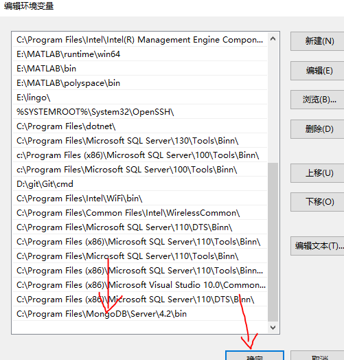

# MongoDB安装教程
- 网页链接 https://www.mongodb.com/download-center/community?jmp=nav

- 去官网下载 （这是目前的最新版本）  mongodb-win32-x86_64-2012plus-4.2.0-signed.msi

- 选择适合自己电脑的版本

- 

- 点击next

- 

- 勾选上，点击next

- 

- **可把程序安装在c盘，如果c盘空间不够大，可安装在其他盘，或只把可执行程序安装在c盘(占用空间较小)，data文件和log文件安装在其他盘的`根目录`下**

- 

- 

- 开始安装

- 

- 

- 查看是否在对应的文件夹下已经有了相应的文件

- 

- 

- 

- 配置环境变量，设置环境变量的path路径，在于指向MongoDB可执行文件的目录，确保每次可在任何目录下启动MongoDB shell功能

- 

- 

- 在命令行输入mongo，出现如下界面，则以安装成功

- 

- 命令行输入services.msc，使得每一次开机都是自动启动

- 

