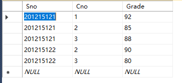

# 数据定义 
SQL的数据定义功能包括模式定义、表定义、视图和索引的定义  

- 模式 
    - 创建：create schema 
    - 删除：drop schema
-  表 
    - 创建：create table 
    - 删除：drop table
    - 修改：alter table

- 视图
    - 创建：create view
    - 删除：drop view

- 索引 
    - 创建：create index
    - 删除：drop index
    - 修改：alter table

## 模式定义与删除

### 定义模式

create schema<模式名> authorization<用户名>  ;

### 删除模式
drop schema<模式名> \<cascade|restrict\>;

- cascade （级联）  
    
    表示删除模式的同时把该模式中所有的数据库对象全部删除

- restrict （限制）

    表示该模式中已经定义了下属的数据库对象（如表、视图等），则拒绝该删除语句的执行

## 基本表的定义、删除与修改

### 定义基本表

create table<表名> (<列名><数据类型>\[列级完整性约束\]
                    <列名><数据类型>\[列级完整性约束\]
                    ...
                    \[表级完整性约束条件\]);

### 数据类型

下面给出几种常用的数据类型 

数据类型 | 含义
 :- | :-
char(n),character(n) | 长度为n的定长字符串
varchar(n),charactervarying(n) | 最大长度为n的变长字符串
int | 长整数（4字节）
smallint | 短整数（2字节）
bigint | 大整数（4字节）
boolean | 逻辑布尔量
date | 日期，包含年、月、日，格式为YYYY-MM-DD
time | 时间，包含一日的时、分、秒，格式为HH:MM:SS


### 模式与表

每一个基本表都属于某一个模式，一个模式包含多个基本表。  

在用户创建基本表时若没有定义模式，系统根据搜索路径来确定该对象所属地模式，搜素路径包含一组模式列表，关系数据库管理系统会使用模式列表中**第一个存在**的模式，作为数据库对象的模式名；若搜索路径中模式名不存在，系统将给出错误。

- 在表中明显地给出模式名

    create table "S-T".Student(...);

- 在创建模式语句中同时创建表

- 设置所属地模式，这样在创建表时表名中不必给出模式名

### 修改基本表

alter table<表名>  
\[add \[column\]<新列名><数据类型> \[完整性约束\]\]  
\[add <表级完整性约束>\]  
\[drop \[column\]<列名> \[cascade|restrict\]\]  
\[alter column<列名><数据类型>\]  ;


### 删除基本表

drop table<表名> \[restrict|cascade\] ;

## 索引的建立与删除

常见索引：

- 顺序文件上的索引

- B+树索引

- 散列索引

- 位图索引

### 建立索引

create \[unique\] \[cluster\] index <索引名>  
on <表名>(<列名> \[<次序>\]\[,<列名>\[<次序>\]\]...);   

升序 ASC  降序  DESC

### 修改索引

alter index <旧索引名> rename to <新索引名> ; 

### 删除索引

drop index <索引名>;

# 数据查询

## 单表查询

单表查询是指仅涉及一个表的查询

使用t-sql语句创建了如下三张表

```sql
create table Student
( 
	Sno char(9) primary key,
	Sname char(20) unique,
	Ssex char(2),
	Sage smallint,
	Sdept char(20)
);

create table Course
(
	Cno char(4) primary key,
	Cname char(40) not null,
	Cpno char(4),
	Ccredit smallint,
);

create table SC
(
	Sno char(9),
	Cno char(4),
	Grade smallint,
	primary key (Sno,Cno),
);

insert into Student values ('201215121','李勇','男',20,'CS');
insert into Student values ('201215122','刘晨','女',19,'CS');
insert into Student values ('201215123','王敏','女',18,'MA');
insert into Student values ('201215125','张立','男',19,'IS');


insert into Course values ('1','数据库','5',4);
insert into Course values ('2','数学',null,2);
insert into Course values ('3','信息系统','1',4);
insert into Course values ('4','操作系统','6',3);
insert into Course values ('5','数据结构','7',4);
insert into Course values ('6','数据处理',null,2);
insert into Course values ('7','PASCAL语言','6',4);

insert into SC values ('201215121','1',92);
insert into SC values ('201215121','2',85);
insert into SC values ('201215121','3',88);
insert into SC values ('201215122','2',90);
insert into SC values ('201215122','3',80);
```

**Student**
  
  
**Course**  
  

**SC**  


### 选择表中的若干列
【例】查询全体学生的学号与姓名
```sql
select Sname,Sno from Student;
```

【例】查询全体学生的详细信息
```sql
select * from Student;
```

【例】查询全体学生的姓名及其出生年份
```sql
select Sname,2019-Sage from Student;
```

【例】用户可以通过指定别名来更改查询结果的列标题
```sql
select Sname name,'year of birth:' birth,2014-Sage birthday,lower(Sdept) department from Student;
```


### 选择表中若干元组

#### 消除取值重复的行 distinct
两个本来不相同的元组在投影到指定的某些列上后，可能会变成相同的行。可以使用distinct来消除他们；如果没有distinct关键字，则默认为all。

```sql
select Sno from SC;
select all Sno from SC;
select distinct Sno from SC;
```

#### 查询满足条件的元组

通过where子句实现  

以下是where子句常用的查询条件  
查询条件 | 谓词
:- | :-
比较 | = , > , <  , >= , <= , != , <> , !> , !< ; not+上述比较运算符
确定范围 | between and ， not between and
确定集合 | in ， not in
字符匹配 | like ， not like
空值 | is null ， is not null
多重条件 | and ， or ， not

其中，**字符匹配**：  
% ： 表示任意长度的字符串（长度可以为0）  
_ ： 代表任意单个字符串  
如果用户要查询的字符串本身就包含有通配符%或者_，这时就要使用escape '<换码字符>'短语字符对通配符进行转义了  


【例】查询年龄不在20~23之间的学生的详细信息
```sql
select * from Student where Sage not between 20 and 23;
```

【例】查询DB_Design课程的课程号和学分
```sql
select * from Course where Cname like 'DB\_Design' escape'\';
```

【例】涉及空值的查询
某些同学选修课程后没有参加考试，所以有选课记录，但没有考试成绩，查询缺少成绩的学生学号和相应的课程号  
**`注意：这里的is不能用=代替`**
```sql
select Sno,Cno from SC where Grade is null;
```

【例】多重查询条件
and和or可以用来连接多个查询条件。and的优先级高于or，但是可以通过使用括号来改变优先级  
查询计算机科学系年龄在20岁以下的学生姓名
```sql
select Sname from Student where Sdept='CS' and Sage<=20
```

### order by

通过order by子句可以对查询结果按照属性列的升序（ASC）或者降序（DESC）排列，默认为升序

【例】将SC表按照Grade的降序排列
```sql
select * from SC order by Grade desc;
```

### 聚集函数

- count(*) 统计元组个数

- count(\[distinct|all\]<列名>) 统计一列中值的个数

- sum(\[distinct|all\]<列名>) 计算一列值的和（此列必须是数值型）

- avg(\[distinct|all\]<列名>) 计算一列值的平均值（此列必须是数值型）

- max(\[distinct|all\]<列名>) 求一列值中的最大值

- min(\[distinct|all\]<列名>) 求一列值中的最小值

【例】查询学生总人数
```sql
select count(*) from Student;
```

【例】查询选修了课程的学生人数
```sql
select count(distinct Sno) from SC ; 
```

【例】计算选修一号课程的学生平均成绩
```sql
select avg(Grade) from SC where Cno='1';
```

【例】查询学生学号为201215122选修课程的总分
```sql
select sum(Grade) from SC where Sno='201215122';
```

### group by
group by子句将查询结果按某一列或多列的值分组，值相等的为一组  

【例】求各个课程号及相应的选课人数
```sql
select Cno,count(Sno) from SC group by Cno;
```

【例】查询选修了三门课以上的学生学号
```sql
select Sno from SC group by Sno having count(*)>3;
```

解析：这里先用group by子句按Sno分组，再用聚集函数count对每一组进行计数；**注意这里使用的是having**，只有满足条件（元组的个数>3，表示学生选修的课超过三门）的组才会被选出来。

## 连接查询

### 等值与非等值连接查询

### 自身连接

### 外连接

### 多表连接

## 嵌套查询

### 带有IN谓词的子查询

### 带有比较运算符的子查询

### 带有ANY（SOME）或ALL谓词的子查询

### 带有EXISTS谓词的子查询