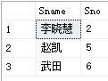

# 选择题
1. 在Transact-SQL语法中，SELECT语句的完整语法较复杂，但至少包括的部分（\_），使用关键字（\_）可以把重复行屏蔽，将多个查询结果返回一个结果集合的运算符是（\_），如果在SELECT语句中使用排序时，一定在后面使用（\_）  
（1） A、SELECT ，INTO  
**B、SELECT ， FROM**  
C、SELECT ， GROUP  
D、仅SELECT  
（2）**A、DISTINCT**  
B、UNION  
C、ALL  
D、TOP  
（3）A、JOIN  
**B、UNION**  
C、INTO  
D、LIKE  
（4）A、GROUP BY  
B、COMPUTE BY  
**C、ORDER BY**  
D、COMPUTE  
2. 下列哪个约束不可以为空？（）  
**A、主键**  
B、外键  
C、默认键  
D、UNIQUE 约束  
3. 在SQL的查询语句中，若查询记录中所有au_id满足前两个字母为“88”的记录，则下列正确的where子句是（）  
A、where au_id='88%'  
B、where au_id = link '88%'  
**C、where au_id like '88%'**  
D、where au_id link '88%'  
4. SQL语言中，删除一个视图的命令是（）  
A、DELETE VIEW  
**B、DROP VIEW**  
C、CLEAR VIEW
D、REMOVE VIEW

# 解答题

使用如下命令创建三张表  
- C表：课程表
    - Cno 课程号
    - Cname 课程名称
    - Cteacher 老师姓名
- S表：学员表
    - Sno ： 学生学号
    - Sname ： 学生姓名
- SC表：成绩表
    - Sno ： 学生学号
    - Cno ： 课程号
    - Grade : 学生成绩

```sql
create table S
(
	Sno char(10) primary key,
	Sname char(20) unique
);

create table C
(
	Cno char(10) primary key,
	Cname char(20) not null,
	Cteacher char(40) not null
);

create table SC
(
	Sno char(10),
	Cno char(10),
	Grade smallint
); 
```


)  

## 1.选修过“李明”老师讲授课程的所有学生姓名，学生学号 
【分析】：知道的是老师的信息，老师的姓名Cteacher在C表中，学生姓名Sname这个信息在S表中，SC表将S和C这两个表关联起来，所以该查询语句中要使用到3个表。  

```sql
/*嵌套查询*/
select Sname,Sno
from S
where Sno in (
	select Sno 
	from SC
	where Cno in (
		select Cno
		from C
		where Cteacher='李明'));
```

```sql
/*连接查询*/
select Sname,Sno 
from S 
where Sno in(
	select Sno
	from SC,C
	where SC.Cno=C.Cno and C.Cteacher='李明');
```


## 2.找出没有选修“李明”老师讲授课程的所有学生姓名
【分析】这个题的答案正好是上面那个题的取反

**错误代码**
【分析】：从里向外看，由上表可以知道李明老师所教的课程号是5，所以最里层返回的是1，2，3，4，比如上面的张明同学，让选修了李明老师的课，但是这里结果右显示他没有选修过，那是因为他也选修了1，2，3，4号课程中的一些课，所以返回了张明同学的姓名和学号
```sql
select Sname,Sno
from S
where Sno in (
	select Sno 
	from SC
	where Cno in(
		select Cno
		from C
		where Cteacher !='李明'));
```


**正确代码**  
【分析】由C表可以知道最里层返回的是5，中间那一层返回的是学修了李明老师的课程的学号，再使用not in，有点取反的意思，最终可以得到正确答案
```sql
/*嵌套查询*/
select Sname,Sno
from S
where Sno not in (
	select Sno 
	from SC
	where Cno in(
		select Cno
		from C
		where Cteacher='李明'));

/*连接查询*/
select Sname,Sno
from S
where Sno not in(
	select Sno 
	from SC,C
	where SC.Cno=C.Cno and Cteacher='李明');
```


## 3.列出两门课以上（含两门）不及格课程的学生姓名及其平均成绩
【分析】：这个题目涉及到学生的成绩（SC）和学生的姓名（S），所以要使用到两个表。这里创建了一个派生表，里面是不及格成绩大于等于2的学生的学号，然后用连接查询，把这三个表连接起来，按照学生的姓名分组最后得到正确答案
```sql
/*派生表 连接查询*/
select S.Sname,avg(SC.Grade)
from S,SC,(select Sno from SC where Grade<60 group by Sno having count(*)>=2) as S1
where S.Sno=S1.Sno and SC.Sno=S1.Sno
group by S.Sname
```
<br/>
【分析】:内层的select查询返回的是不及格课程的数目大于等于2的学生的学号然后将SC，S连接，按照名字分组，最后得到正确答案

```sql
/*连接查询 嵌套查询*/
select Sname,avg(Grade)
from S,SC
where S.Sno=SC.Sno and SC.Sno in(
	select Sno 
	from SC
	where Grade<60
	group by Sno
	having count(*)>=2
)
group by Sname
```


## 4.列出既学过名称为“1”的课程，又学过名称为2的课程的所有学生姓名，学号

【分析】看到既...又...这种表达方式就想到了集合查询中的交操作（intersect）
```sql
select Sname
from S
where Sno in (
	select Sno 
	from SC,C
	where SC.Cno=C.Cno and Cname='1'
)
intersect
select Sname
from S
where Sno in (
	select Sno 
	from SC,C
	where SC.Cno=C.Cno and Cname='2'
)
```
【分析】：内层查询里返回的是既选了1号课程又选了2号课程的学生的学号，选出来以后再与S表进行连接
```sql
select Sname,S.Sno
from S,(select Sno
		from SC,C
		where SC.Cno=C.Cno and Cname in ('1','2')
		group by SC.Sno
		having count(*)=2) S1
where S.Sno=S1.Sno
```


## 5. 列出所有“1”号课程比“2”号课程成绩高的学生的姓名以及他们的学号
【分析】: 用了两个派生表，分别表示选修了“1”号课程的学生的学号和成绩，选修了“2”号课程学生的学号和成绩，最后使用连接运算，在比较S1和S2表中的成绩大小，输出“1”号课程成绩比“2”好课程成绩大的学生的学号和姓名  

```sql
select Sname,S.Sno
from S,(select Sno,Grade from SC,C where SC.Cno=C.Cno and C.Cname='1') as S1,
	 (select Sno,Grade from SC,C where SC.Cno=C.Cno and C.Cname='2') as S2
where S.Sno=S1.Sno and S1.Sno=S2.Sno and S1.Grade > S2.Grade
```


## 6. 列出“1”号课程比“2”号课程成绩高的所有学生的姓名学号以及“1”号和“2”号课程的成绩

【分析】只要在上一题的基础上，添加Grade就可以

```sql
select Sname,S.Sno,S1.Grade,S2.Grade
from S,(select Sno,Grade from SC,C where SC.Cno=C.Cno and C.Cname='1') as S1,
	 (select Sno,Grade from SC,C where SC.Cno=C.Cno and C.Cname='2') as S2
where S.Sno=S1.Sno and S1.Sno=S2.Sno and S1.Grade > S2.Grade
```


## 7. 查询没有选修课程编号为“5”的学员的学号，姓名
【分析】： 这题我的思路是先找到选修了课程编号为“5”的学生学号，再用not in 就可以得到没有选修课程编号为“5”的学生的学号，注意，和第2题一样，不能将否定的条件加在`SC.Cno!=5`上， `SC.Cno!=5`相当于返回的是选修了“1”，“2”，“3”，“4”课程的学生，但是可能这些学生有选修了前四个，有选修了“5”，所以也会被返回。

**错误代码**
```sql
select Sname,Sno
from S
where Sno in (
	select Sno
	from SC
	where SC.Cno!='5'
)
```


**正确代码**
```sql
select Sname,Sno
from S
where Sno not in (
	select Sno
	from SC
	where SC.Cno='5'
)
```


## 8. 查询选修课程编号为“1”的学员的学号，姓名
【分析】: 该查询内容涉及S、SC、表，所以将S表与SC表进行连接，选出课程编号为“1”的学生信息即可  

```sql
select SC.Sno,Sname
from S,SC
where S.Sno=SC.Sno and SC.Cno='1'
```


## 9. 查询选修了课程名称是“5”的学生的学号和姓名
【分析】: 课程名称在C表中，学生的学号和姓名在S表中，SC表将两者联系在一起，查找满足条件的Sno，将C与SC连接起来，并且挑选Cname='5'的Sno

```sql
/*连接查询*/
select Sname,Sno
from S
where Sno in (
	select Sno
	from SC,C
	where C.Cno=SC.Cno and Cname='5'
)

/*嵌套查询*/
select Sname,Sno
from S
where Sno in (
	select Sno
	from SC 
	where Cno in(
		select Cno
		from C
		where Cname='5'
	)
)
```


## 10. 查询选修了课程的学员的人数
【分析】需要使用到聚集函数count，并且要使用distinct

```sql
select count(distinct Sno) from SC
```


## 11. 查询选修了全部课程的学员的学号
【分析】：创建了一个派生表，最后根据Sno将S1表和S表连接起来，派生表返回的是选修了全部课程的学生的学号，按照Sno分组，并统计每个人选修的课程的数据，留下课程数等于总课程数的学号

```sql
select S.Sno,Sname
from S,(select Sno from SC group by Sno having count(Cno)=(select count(*) from C)) S1
where S.Sno=S1.Sno
```


## 12. 查询选修课程超2门的学生学号和姓名

【分析】：首先想到要用的聚集函数，在SC表里按照Sno分组，再将S表与SC表自然连接就可以

```sql
select SC.Sno,Sname 
from SC,S
where SC.Sno=S.Sno
group by SC.Sno,Sname
having count(*) > 2
```
